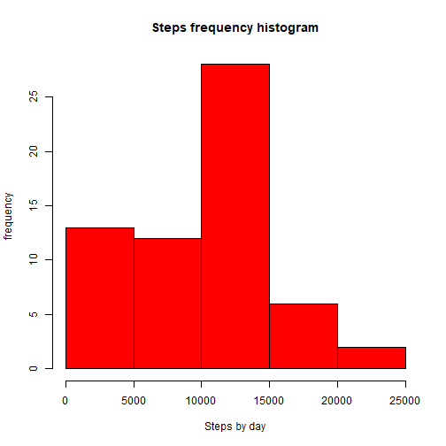
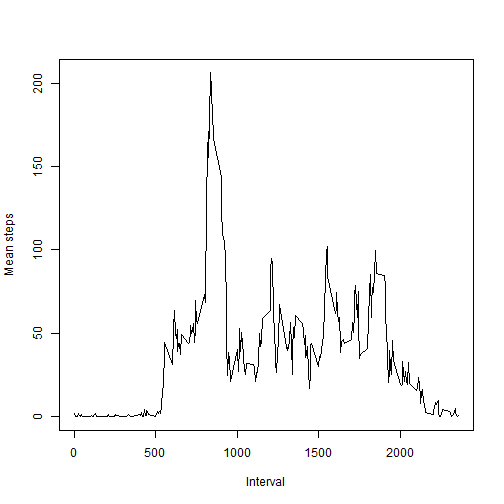
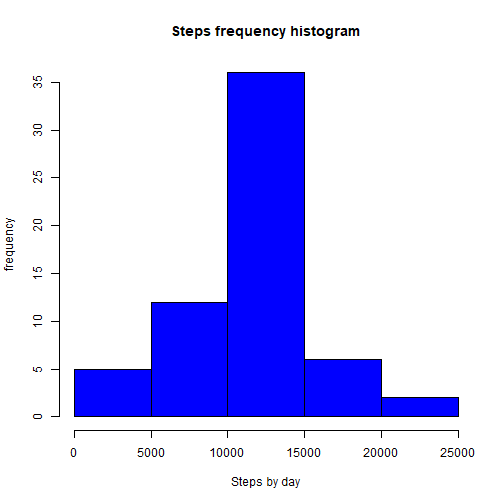
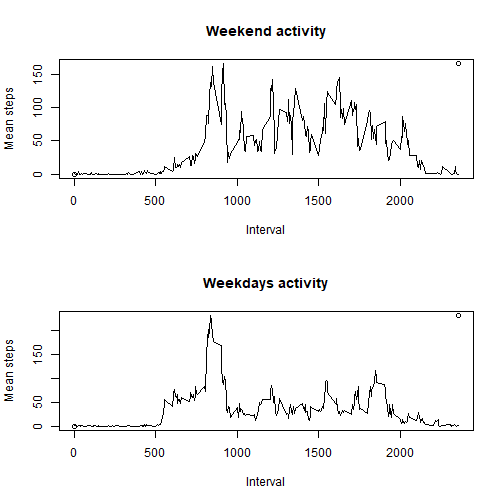

## Loading and preprocessing the data
The steps that i need to make the analysis was divide in the next steps

1. read de data from zip file in data variable.


```r
data <- read.table(unz("activity.zip", "activity.csv"), 
                  header=T, 
                  quote="\"", 
                  sep=",")
```
2. Summarize original data by day

```r
library(dplyr)
byday <- group_by(data, date)
sumbyday <- summarize(byday, totalsteps = sum(steps,na.rm = TRUE),
					 meansteps = mean(steps, na.rm = TRUE),
					 mediansteps = median(steps, na.rm = TRUE))
```
3. Summarize original data by interval

```r
byinterval <- group_by(data,interval)
sumbyinterval <- summarize(byinterval, meansteps= mean(steps,na.rm=TRUE))
```


## What is mean total number of steps taken per day?
1. Make a histogram of the total number of steps taken each day

```r
hist(as.numeric(sumbyday$totalsteps),main = "Steps frequency histogram", xlab="Steps by day", ylab="frequency",col="red")
```




2. Calculate and report the mean and median total number of steps taken per day


```r
sumbyday
```

```
## # A tibble: 61 x 4
##          date totalsteps meansteps mediansteps
##        <fctr>      <int>     <dbl>       <dbl>
##  1 2012-10-01          0       NaN          NA
##  2 2012-10-02        126   0.43750           0
##  3 2012-10-03      11352  39.41667           0
##  4 2012-10-04      12116  42.06944           0
##  5 2012-10-05      13294  46.15972           0
##  6 2012-10-06      15420  53.54167           0
##  7 2012-10-07      11015  38.24653           0
##  8 2012-10-08          0       NaN          NA
##  9 2012-10-09      12811  44.48264           0
## 10 2012-10-10       9900  34.37500           0
## # ... with 51 more rows
```
## What is the average daily activity pattern?

1. Make a time series plot (i.e. type = "l") of the 5-minute interval (x-axis) and the average number of steps taken, averaged across all days (y-axis)


```r
xrange <- range(sumbyinterval$interval)
yrange <- range(sumbyinterval$meansteps)
plot(xrange, yrange, type="n", xlab="Interval",ylab="Mean steps" ) 
lines(sumbyinterval$interval,sumbyinterval$meansteps)
```



2. Which 5-minute interval, on average across all the days in the dataset, contains the maximum number of steps?


```r
filter(sumbyinterval, sumbyinterval$meansteps == max(sumbyinterval$meansteps))	 
```

```
## # A tibble: 1 x 2
##   interval meansteps
##      <int>     <dbl>
## 1      835  206.1698
```
## Imputing missing values
Note that there are a number of days/intervals where there are missing values (coded as NA). The presence of missing days may introduce bias into some calculations or summaries of the data.

Calculate and report the total number of missing values in the dataset (i.e. the total number of rows with NAs)

```r
sum(is.na(data$steps))
```

```
## [1] 2304
```
Devise a strategy for filling in all of the missing values in the dataset. The strategy does not need to be sophisticated. For example, you could use the mean/median for that day, or the mean for that 5-minute interval, etc.

My strategy for fill missing values consist in fill with the mean in the interval,
for do this i merge the original data frame, named "data" with the data frame named sumbyinterval

```r
data2 <- merge(data, sumbyinterval, by="interval")
```
after that i have a new dataset with means from every interval calculate a new column with the value of steps or mean of interval

```r
head(data2)
```

```
##   interval steps       date meansteps
## 1        0    NA 2012-10-01  1.716981
## 2        0     0 2012-11-23  1.716981
## 3        0     0 2012-10-28  1.716981
## 4        0     0 2012-11-06  1.716981
## 5        0     0 2012-11-24  1.716981
## 6        0     0 2012-11-15  1.716981
```
now, i compute a new column "calcsteps" with the number of steps or the average if the value of steps is missing. This new dataset that is equal to the original dataset but with the missing data filled in the new column.


```r
data2<- mutate(data2,calcsteps=ifelse(is.na(steps),meansteps,steps))
```

Make a histogram of the total number of steps taken each day and Calculate and report the mean and median total number of steps taken per day. Do these values differ from the estimates from the first part of the assignment? What is the impact of imputing missing data on the estimates of the total daily number of steps?


```r
bydayfilldata <- group_by(data2, date)
sumbydayfilldata <- summarize(bydayfilldata, totalsteps = sum(calcsteps),
					 meansteps = mean(calcsteps),
					 mediansteps = median(calcsteps))

hist(as.numeric(sumbydayfilldata$totalsteps),main = "Steps frequency histogram", xlab="Steps by day", ylab="frequency",col="blue")
```



the values with new dataset are:


```r
sumbydayfilldata
```

```
## # A tibble: 61 x 4
##          date totalsteps meansteps mediansteps
##        <fctr>      <dbl>     <dbl>       <dbl>
##  1 2012-10-01   10766.19  37.38260    34.11321
##  2 2012-10-02     126.00   0.43750     0.00000
##  3 2012-10-03   11352.00  39.41667     0.00000
##  4 2012-10-04   12116.00  42.06944     0.00000
##  5 2012-10-05   13294.00  46.15972     0.00000
##  6 2012-10-06   15420.00  53.54167     0.00000
##  7 2012-10-07   11015.00  38.24653     0.00000
##  8 2012-10-08   10766.19  37.38260    34.11321
##  9 2012-10-09   12811.00  44.48264     0.00000
## 10 2012-10-10    9900.00  34.37500     0.00000
## # ... with 51 more rows
```
## Are there differences in activity patterns between weekdays and weekends?

1. Create a new factor variable in the dataset with two levels - "weekday" and "weekend" indicating whether a given date is a weekday or weekend day.

I create a new column named weekend, the values are 1 when the day of week is saturday o sunday, is important to note that the weekdays function used in this calculation returns the day name in the current locale, i run this program with spanish locale, for this reason i compare with day names in spanish(sabado ->saturday, domingo->sunday)


```r
data2 <- mutate(data2,weekend=ifelse(weekdays(as.Date(date)) == "sábado" | weekdays(as.Date(date)) == "domingo",1,0))

weekend <- filter(data2,weekend==1)
weekendbyinterval = summarize(group_by(weekend,interval),meansteps=mean(calcsteps))

weekday<- filter(data2,weekend==0)
weekdaybyinterval = summarize(group_by(weekday,interval),meansteps=mean(calcsteps))


xrangewe <- range(weekendbyinterval$interval)
yrangewe <- range(weekendbyinterval$meansteps)

xrangewd <- range(weekdaybyinterval$interval)
yrangewd <- range(weekdaybyinterval$meansteps)
```
this is the image comparing activity in weekends vs weekdays.


```r
par(mfrow = c(2, 1))
{
	plot(xrangewe, yrangewe, main="Weekend activity", xlab="Interval",ylab="Mean steps" ) 
	lines(weekendbyinterval$interval,weekendbyinterval$meansteps)

	plot(xrangewd, yrangewd, main="Weekdays activity", xlab="Interval",ylab="Mean steps" ) 
	lines(weekdaybyinterval$interval,weekdaybyinterval$meansteps)
}
```


